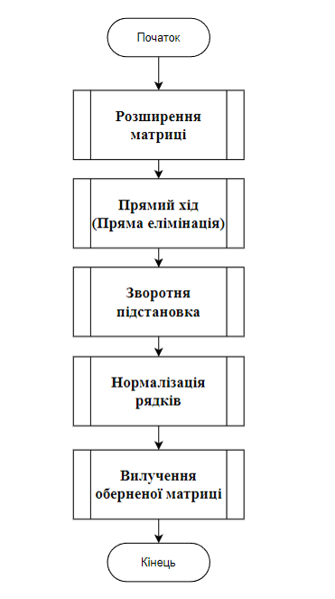
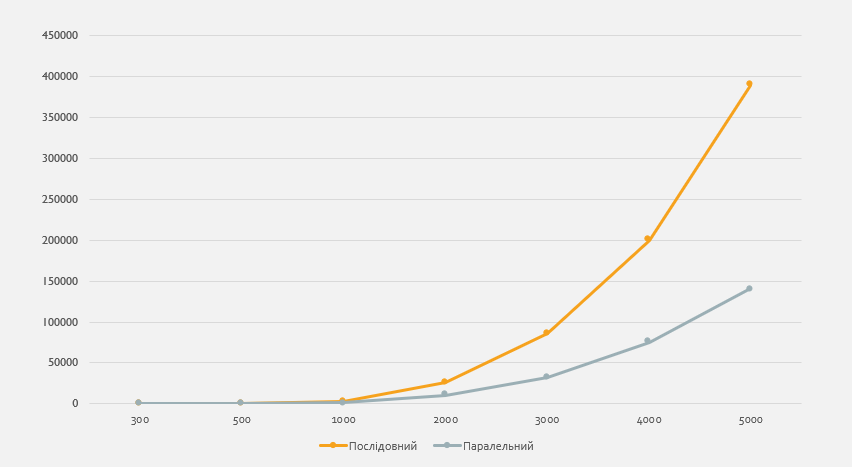
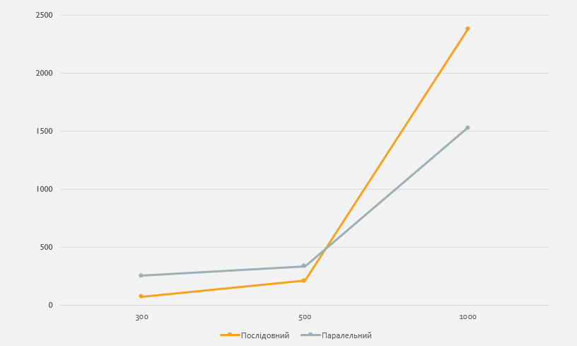
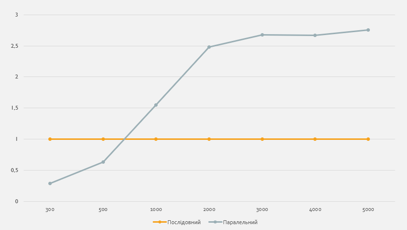

# Parallel_Gauss-Jordan_Algorithm
An algorithm for finding the inverse matrix using the Gauss-Jordan method on Java

## Тема

Алгоритм Гауса-Жордана та його паралельна реалізація Java

## Мета

Реалізувати паралельну версію алгоритму Гауса-Жордана в Java з використанням відповідних технологій паралельного програмування. 
Провести експериментальне дослідження ефективності паралельної реалізації алгоритму Гауса-Жордана порівняно з його послідовною версією.

### Загальні положення послідовного алгоритму

Обернена матриця А^(−1) до квадратної матриці 𝐴 визначається таким чином, що множення матриці A на 〖 А〗^(−1) дає одиничну матрицю  I:
〖 A∗А〗^(−1)=𝐼
Алгоритм складається з декількох кроків:
- Розширення матриці: Спочатку до початкової матриці A додається одинична матриця I, щоб утворити розширену матрицю.
- Фаза гауссового виключення
- Нормалізація: Після зведення до ступінчастого  вигляду кожен рядок нормалізується шляхом ділення кожного елемента рядка на значення елемента на діагоналі (тобто на головний елемент) цього рядка. Це дійсно дозволяє отримати на місці початкової матриці одиничну матрицю I, а на місці розширеної матриці - обернену матрицю  А^(−𝟏).



### Реалізація паралельного алгоритму

Прямий хід полягає у тому, щоб зробити нульовими всі елементи під діагональними елементами матриці. Це можна зробити шляхом віднімання від рядків підставляються змінені верхні рядки, множені на коефіцієнти.

///Forward Elimination
```// Forward Elimination
    for pivotRow from 0 to n - 1:
        for currentRow from pivotRow + 1 to n - 1:
            factor = augmentedMatrix[currentRow][pivotRow] / augmentedMatrix[pivotRow][pivotRow]
            addFuture(futures, executor, currentRow, pivotRow, factor, augmentedMatrix)
 
    waitAllFutures(futures)
    futures.clear()
```
### Обернений хід
Після прямого ходу виконується обернена підстановка, щоб отримати одиничну матрицю на місці початкової матриці A. Це робиться шляхом віднімання від рядків підставляються змінені нижні рядки, множені на коефіцієнти. 

/// Backward Substitution
```
    for pivotRow from n - 1 to 0 step -1:
        for currentRow from pivotRow - 1 to 0 step -1:
            factor = augmentedMatrix[currentRow][pivotRow] / augmentedMatrix[pivotRow][pivotRow]
            addFuture(futures, executor, currentRow, pivotRow, factor, augmentedMatrix)
 
    waitAllFutures(futures)
    futures.clear()
```
 /// Normalize each row
```
    for i from 0 to n - 1:
        divisor = augmentedMatrix[i][i]
        addFuture(futures, executor, i, divisor, augmentedMatrix)
 
    waitAllFutures(futures)
    executor.shutdown()
```
### ДОСЛІДЖЕННЯ ЕФЕКТИВНОСТІ ПАРАЛЕЛЬНИХ ОБЧИСЛЕНЬ АЛГОРИТМУ



Час(мілісекунди) виконання кожного з алгоритмів, відносно розмірності матриці



Час виконання кожного з алгоритмів, відносно розміру матриці(Для матриць розмірністю 300-1000)



Прискорення паралельного алгоритму над послідовним відносно розміру матриць
